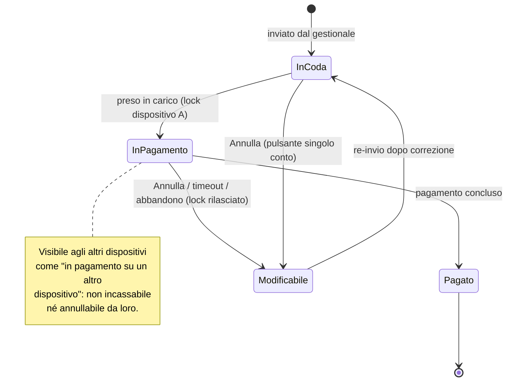

# Contesto — Byup Staff

Documento di contesto del prototipo: cos'è, com'è fatto, le scelte di prodotto prese e
il requisito di dominio sul conto immutabile e la concorrenza.

---

## 1. Cos'è il prototipo

**Byup Staff** è l'**App Staff** di incasso per esercenti (bar/ristoranti) registrati su
**Byup Fresh**. Questo repository è il **prototipo** dell'app: incassa pagamenti con carta
tramite **Tap to Pay**, su **iPhone** (tecnologia Apple) e su **Android** (tecnologia
Google), processato in entrambi i casi da **Stripe** (Stripe Terminal).

Modello operativo: il POS **non compone i conti**, li **incassa**. I conti arrivano già
definiti da una **coda di incasso** alimentata dal gestionale (vedi §4).

> **Nota terminologica.** Il **nome del prodotto è "Byup Staff"** (l'App Staff): è così che
> va chiamato in UI, documenti e comunicazione. La parola **"POS"** in questo documento è
> usata solo come termine **generico** per il *ruolo* dell'app — terminale di
> incasso / point-of-sale — e per il dispositivo fisico (es. "più dispositivi POS"). Non è
> un nome di prodotto: il prototipo **non si chiama "byup POS"**. Per ragioni storiche i
> simboli interni del codice mantengono il prefisso `pos-` / `POSApp`, ma è solo un
> dettaglio implementativo e non va esposto all'utente.

### Stack tecnico

Prototipo **statico**, senza build step:

- React 18 + ReactDOM via CDN (unpkg), JSX compilato **in-browser** con `@babel/standalone`.
- Niente bundler, niente `npm`: si apre `index.html` direttamente nel browser.
- Stato applicativo **tutto in memoria** (React state in `POSApp`): si **azzera al reload**
  della pagina. Nessun `localStorage`/backend — è un mock di flussi e UI.
- Cache-busting manuale: i tag `<script src="...jsx?v=N">` in `index.html` hanno un
  parametro `?v=N` da incrementare a ogni modifica per forzare il reload dei file.

### Piattaforma di destinazione e app reale

Questo repository è un **mock web** (React via CDN): rappresenta solo **UI e flussi** e **non
integra Stripe** né alcun SDK reale. Va distinto dall'**app reale**, che è un'app **mobile
nativa** con integrazione **Stripe Terminal** per il Tap to Pay.

**Target: iPhone _e_ Android.** Il Tap to Pay esiste in due tecnologie distinte — *Tap to Pay
on iPhone* (Apple) e *Tap to Pay on Android* (Google) — entrambe esposte dallo **Stripe
Terminal SDK**. L'app deve girare su entrambe.

**Scelta tecnica: React Native.** Per coprire le due piattaforme da **una sola codebase** si
adotta **React Native**, perché è l'**unico SDK cross-platform supportato ufficialmente da
Stripe** per il Tap to Pay (*Stripe Terminal React Native*, che copre Tap to Pay sia su iPhone
sia su Android). Le alternative scartate:

- **iOS nativo + Android nativo**: pienamente supportati, ma sono **due codebase** separate da
  mantenere in parallelo.
- **Flutter**: **non** ha un SDK Terminal ufficiale Stripe (esistono solo wrapper community,
  non garantiti) → **escluso** per una funzione critica come l'incasso, dove i vincoli di
  certificazione/entitlement di Apple e Google sono stringenti.

React Native riusa inoltre lo **stesso modello a componenti** di questo prototipo, rendendo il
porting dei flussi più diretto.

**Nota sulla resa per piattaforma.** La **cornice iPhone** e gli **alert/permessi in stile
iOS** di questo mock sono **illustrativi di una sola piattaforma**. Nell'app reale i **dialog
di sistema** (permessi posizione, termini Tap to Pay) e soprattutto l'**overlay di lettura
carta** durante il tap sono **forniti dal sistema operativo** (Apple su iPhone, Google su
Android) e **differiscono** per stile: l'app controlla l'importo, il flusso e l'esito, **non**
l'animazione di lettura NFC. La schermata `tap` del prototipo è quindi *illustrativa*, non
letterale.

### Struttura dei file

| File | Ruolo |
|------|-------|
| `index.html` | Mount dell'app dentro la cornice iPhone; carica gli script `.jsx` |
| `ios-frame.jsx` | Cornice del dispositivo (`IOSDevice`) che contiene lo schermo del telefono — **illustrativa** (stile iOS); l'app reale è iOS + Android |
| `pos-tokens.jsx` | Design tokens (`ST`) — brand, neutri e materiali **ereditati dai token `PN` del gestionale** (`../gestionale/panoramica-tokens.jsx`, caricato prima da `index.html`) — icone (`I`), atomi (`Btn`, `Chip`, `Logo`), helper (`eur`, `txConfig`) |
| `pos-data.jsx` | Dati mock: esercente (`MERCHANT`), coda incasso (`CODA_INCASSO`), transazioni (`TRANSAZIONI`) |
| `pos-app.jsx` | Shell, navigazione a stack, bottom nav, stato globale, montaggio delle schermate |
| `pos-screen-login.jsx` | Login, recupero password, **Face ID gate** |
| `pos-screen-incassa.jsx` | Coda di incasso + dettaglio conto |
| `pos-screen-pagamento.jsx` | Flusso di pagamento Tap to Pay |
| `pos-screen-transazioni.jsx` | Storico transazioni (solo giornata corrente) |
| `pos-screen-profilo.jsx` | Profilo esercente, impostazioni, modifica password |
| `pos-modali.jsx` | Bottom sheet e alert: ricevuta, dettaglio transazione, permessi, conferme, pagine legali |

### Navigazione e schermate

`POSApp` tiene uno **stack** di schermate (`push`/`pop`/`replace`/`reset`/`setTab`).
Schermate: `login`, `recupero`, `incassa`, `conto`, `tap`, `transazioni`, `profilo`,
`password`. La **bottom nav** (Transazioni · Incassa · Profilo) è nascosta su login,
recupero e durante il pagamento (`tap`).

---

## 2. Scelte di prodotto e funzionalità implementate

Sintesi delle decisioni prese in fase di prototipazione e di cosa è stato realizzato.

### 2.1 Sblocco con Face ID

Tre comportamenti, coerenti col pattern delle app bancarie:

- **Re-login con Face ID** (`FaceIdGate` in `pos-screen-login.jsx`): se il Face ID è
  attivo, all'apertura del login parte la schermata di sblocco animata.
  **Scelta esplicita: il primo tentativo fallisce sempre** ("Volto non riconosciuto"),
  con i bottoni *Riprova con Face ID* (al secondo giro sblocca) e *Usa la password*
  (fallback al form classico).
- **Proposta al primo accesso**: la sequenza permessi di primo accesso (Tap to Pay →
  posizione) termina con il prompt *"Vuoi sbloccare con il Face ID?"* (*Attiva Face ID* /
  *Non ora*).
  Appare **una sola volta** (flag `faceIdAsked`).
- **Toggle nel Profilo**: interruttore *Sblocco con Face ID* per attivare/disattivare in
  qualsiasi momento.

**Decisioni:**
- Lo stato (`faceIdOn`, `faceIdAsked`) vive in `POSApp`: **persiste tra logout/login nella
  stessa sessione**, si resetta al reload — comodo per ri-dimostrare il primo accesso.
- **Attivare** è immediato; **disattivare** richiede conferma (vedi §2.3): protegge da
  spegnimenti accidentali senza mettere attrito su chi vuole più sicurezza.

### 2.2 Conferma di uscita (logout)

Da **Profilo → Esci** compare un alert di sistema ("Uscire da Byup Staff?") con
*Annulla* / *Esci*. Riusa il componente `SystemAlert`.

> Lo stile iOS dell'alert fa parte della **cornice illustrativa** del prototipo (vedi
> §1 "Piattaforma di destinazione"). Nell'app reale l'aspetto dipende dal **dispositivo
> dell'utente** che scarica Byup Staff: stile iOS su iPhone, Material su Android.

### 2.3 Conferma disattivazione Face ID

Spegnendo il toggle Face ID dal Profilo compare l'alert "Disattivare il Face ID?"
(*Annulla* / *Disattiva*). Attivarlo resta invece immediato.

### 2.4 Reinvio ricevuta dalle transazioni

Dal **dettaglio di una transazione**, il bottone **Ricevuta** apre lo **stesso flusso**
del pagamento (`RicevutaSheet`): scelta canale **SMS / Email**, inserimento contatto,
conferma "Ricevuta inviata" con l'importo della transazione selezionata. Il recapito non viene
conservato (D-23 · P-21): il reinvio riapre lo sheet a campo vuoto con la riga che lo dice, e
sulla transazione resta il solo canale.

### 2.5 Transazioni: vista a giornata singola

La schermata **Transazioni** mostra **solo la giornata corrente**:

- card in alto "Incassato oggi" + lista delle sole transazioni di oggi → **coerenti**;
- rimossi i raggruppamenti per data e il gruppo "Ieri".

**Motivazione:** il POS è uno strumento **operativo da cassa**; il numero rilevante a
colpo d'occhio è l'incasso *di oggi*. Il riepilogo su periodi estesi è un dato di
**reportistica/contabilità**, che vive sul gestionale. Per questo in fondo alla schermata
c'è la nota:

> Per il riepilogo d'incasso su un periodo più esteso, vai al gestionale web **Byup Fresh**.

**Decisione:** rimborso e reinvio ricevuta restano disponibili dal POS **solo per le
transazioni di oggi**; lo storico esteso (e i rimborsi su transazioni passate) si consultano
sul gestionale **Byup Fresh**. Il bottone *Rimborsa* sul dettaglio **resta**, ma opera solo
entro la giornata corrente.

### 2.6 Login senza registrazione: account creati solo da Byup Fresh

La schermata di login (`pos-screen-login.jsx`) espone **solo l'accesso** — Google SSO oppure
email/password — e **non offre alcuna registrazione**. È una scelta esplicita: da Byup Staff
**non si crea un account**.

**Motivazione:** l'identità è governata interamente dal gestionale **Byup Fresh**. Un account
abilitato all'app Cassa può nascere **solo lì**, in tre modi:

- **creando l'account Cassa** del locale da Byup Fresh;
- **come proprietario** del locale (che ha già accesso);
- **abilitando un altro account** alle funzionalità **Cassa** (provisioning multi-operatore,
  vedi §5.8).

Per questo il login mostra solo *"Non hai un account? Crealo tramite Byup Fresh sul sito
byup.it"*: rimanda al gestionale invece di proporre un form di registrazione. Byup Staff è un
**terminale di incasso**, non un punto di onboarding — coerente con il modello in cui ogni
capacità (comporre conti, gestire utenti, creare account) vive sul gestionale e l'app esegue.

---

## 3. Convenzioni per modificare il prototipo

- Riusare i **token** (`ST`), le **icone** (`I`) e gli **atomi** (`Btn`, `Chip`, `Logo`)
  invece di re-inventare stili inline.
- I token `ST` **ereditano da `PN`** (il sistema del gestionale): brand, neutri e materiali
  **non si ridefiniscono** in `pos-tokens.jsx` — si adatta solo la scala al touch (hit target
  44pt, radius 10/14/18, CTA a pillola). Il file fallisce esplicitamente se `PN` non è
  caricato prima (ordine degli `<script>` in `index.html`).
- Ogni file espone i suoi simboli con `Object.assign(window, { ... })` (niente import: tutto
  globale, caricato in ordine da `index.html`).
- Dopo ogni modifica ai `.jsx`, **incrementare `?v=N`** in `index.html` per bustare la cache.
- I bottom sheet usano `Sheet`; gli alert usano `SystemAlert` (reso in **stile iOS** solo
  come cornice illustrativa del mock — nell'app reale l'aspetto dipende dal dispositivo
  dell'utente, vedi §1); le conferme passano un callback `onConfirm` nel payload del modal.

---

## 4. Requisito di dominio — Conto immutabile e gestione della concorrenza

> Flusso spinto dal gestionale

### Descrizione

Nel flusso in cui il conto viene composto sul gestionale e inviato alla coda di incasso,
**Byup Staff** opera esclusivamente come **terminale di incasso** e **non consente
alcuna modifica del conto**.

Il conto arriva al POS già definito in ogni sua parte:

- tavolo
- righe ordine
- eventuale split tra commensali
- sconti
- importo finale

Il dispositivo può solo procedere al **pagamento dell'importo ricevuto**.

### Unica superficie di modifica: il gestionale

Ogni operazione di modifica del conto avviene **unicamente sul gestionale**, prima
dell'invio alla coda:

- aggiunta o rimozione di righe
- variazione dello split
- applicazione di sconti

Se un conto già inviato necessita di correzioni, **non viene modificato sul POS**: viene
rimandato al gestionale, corretto e re-inviato.

### Azioni disponibili sul POS

Sul conto preso dalla coda, **Byup Staff** espone **due sole azioni**:

| Azione | Effetto |
|--------|---------|
| **Incasso** | Procede al pagamento dell'importo ricevuto |
| **Annulla** | Rimuove il conto dalla coda di incasso, rilascia l'eventuale lock e riporta il conto nello stato modificabile sul gestionale |

Incasso e annulla sono le **uniche due azioni disponibili** sul POS per un conto ricevuto
dalla coda.

#### Pulsante "Annulla" per singolo conto

L'annullamento è esposto come **pulsante dedicato sul singolo conto** in coda: l'operatore
può rimandare indietro al gestionale **uno specifico conto da saldare** senza toccare gli
altri presenti nella coda di incasso.

- L'azione agisce **solo sul conto selezionato**, non sull'intera coda.
- È disponibile per i conti **non presi in carico da un altro dispositivo** (vedi sezione
  concorrenza): un conto in stato "in pagamento su un altro dispositivo" non è annullabile
  finché il relativo lock non viene rilasciato.
- All'annullamento: il conto **lascia la coda**, l'eventuale **lock viene rilasciato** e il
  conto torna **modificabile sul gestionale** per la correzione e l'eventuale re-invio.

Nel prototipo il flusso è implementato: l'azione *Annulla* vive nell'header del **dettaglio
conto** (`ScreenConto`), con alert di conferma (azione *Rimanda al gestionale*) e toast
*"Conto del tavolo N rimandato al gestionale"*; il conto esce dalla coda
(`contiRimandati` in `POSApp`).

> **Prospettiva POS vs gestionale.** Dal punto di vista del **POS**, l'annullamento si
> traduce semplicemente nel fatto che il conto **esce dalla coda di incasso**: l'app non lo
> cancella e non lo conserva, lo restituisce. Il ritorno in **stato modificabile** e
> l'eventuale **re-invio** avvengono **lato gestionale**, fuori dal perimetro dell'Byup Staff.
> Per questo l'annullamento è un *rimando indietro*, non una cancellazione: l'azione va
> comunicata come tale (es. conferma + messaggio "conto rimandato al gestionale"), non come
> eliminazione.

### Concorrenza tra più dispositivi: lock e stato "in pagamento"

Con **più dispositivi POS reali** (es. tre telefoni) che condividono la stessa coda di
incasso, lo stesso conto può essere visto contemporaneamente da più operatori. Serve quindi
un meccanismo di **presa in carico esclusiva** che impedisca a due dispositivi di incassare
lo stesso conto.

#### Comportamento richiesto

Quando un operatore apre/seleziona un conto dalla coda per incassarlo, il conto deve passare
in uno stato **"in pagamento"** e acquisire un **lock** associato al dispositivo che lo ha
preso in carico:

- il conto **resta visibile** sugli altri dispositivi, ma in **stato bloccato / "in
  pagamento su un altro dispositivo"**, non selezionabile per l'incasso;
- il **lock viene rilasciato** quando:
  - il pagamento si conclude (il conto passa in `contiPagati` e lascia la coda), **oppure**
  - il conto viene **annullato** (rimandato al gestionale), **oppure**
  - il dispositivo abbandona l'operazione / scade un eventuale **timeout di lock** (per
    evitare conti bloccati a tempo indeterminato se un dispositivo si disconnette);
- un conto in stato "in pagamento" su un dispositivo **non può essere incassato né
  annullato** da un altro dispositivo.

> **Logica backend, non lato POS.** Il lock è per natura un meccanismo di **backend**:
> richiede una **sorgente di verità condivisa** tra i dispositivi, **presa in carico
> atomica** e **rilascio/timeout** gestiti server-side, con propagazione in tempo reale.
> L'Byup Staff è solo il consumatore di questo stato: mostra il conto come bloccato e ne
> impedisce la selezione, ma non possiede la logica di locking.
>
> **Nel prototipo** questo livello è rappresentato in modo **statico/visivo**: un conto
> della coda è marcato (`inPagamentoAltrove`) e reso non selezionabile (riga grigia, badge
> "In pagamento su un altro dispositivo", nessun chevron), per mostrare *com'è fatto* lo
> stato bloccato. Il comportamento dinamico multi-dispositivo (presa in carico live,
> rilascio, timeout) **non è simulato** nel mock mono-dispositivo.

#### Stati del conto

### Motivazione

Questo vincolo garantisce:

- **un'unica superficie di modifica del conto** (il gestionale);
- l'assenza di **stati incoerenti** derivanti da modifiche concorrenti sulla stessa entità
  da superfici diverse, con le relative **implicazioni fiscali**;
- la **mutua esclusione** in fase di incasso tra più dispositivi POS, evitando doppi
  pagamenti o azioni concorrenti sullo stesso conto.

### Nota — Fase 2

L'eventuale capacità del POS di **selezionare autonomamente un tavolo e comporne il conto**
(porta d'ingresso alternativa, *non* spinta dal gestionale) è un'**estensione successiva**,
coerente con l'evoluzione di **Byup Staff** verso un'**App Staff unica**.

In quel flusso la composizione avverrebbe sul POS stesso. Resta **distinto** dal flusso
spinto dal gestionale qui descritto, in cui il conto è **immutabile**.

---

## 5. Backend — scelte e implicazioni non ovvie

Il prototipo è solo UI/flussi in memoria, ma **implica** una serie di scelte lato backend che
non sono evidenti guardando le schermate. Le fisso qui per non perderle. Dove una scelta è
ancora aperta, è marcata **(da confermare)** e ripresa in §5.x.

### 5.1 Lock e stato condiviso della coda (vedi §4)

È la scelta più importante e già descritta in §4: la **presa in carico esclusiva** dei conti
è logica **server-side**, non del dispositivo.

- Serve una **sorgente di verità condivisa** tra i dispositivi, con **presa in carico
  atomica** (compare-and-set sullo stato del conto) e **propagazione realtime** (es.
  websocket/push) per aggiornare gli altri dispositivi.
- Il **lock ha un timeout** server-side: se un dispositivo prende un conto e si disconnette,
  il conto deve tornare disponibile da solo, senza intervento manuale. Va deciso il valore
  del timeout e cosa succede se il pagamento è in corso allo scadere (vedi 5.3).
- Nel prototipo questo è solo un flag statico `inPagamentoAltrove`: nessun lock reale.

### 5.2 Conto immutabile e identità tra invii

Il conto inviato alla coda è **immutabile** lato POS. Implicazioni:

- Il backend deve **rifiutare** qualsiasi mutazione del conto proveniente dal POS.
- Una correzione = il conto **esce dalla coda**, torna modificabile sul gestionale e viene
  **re-inviato**. **Decisione:** il re-invio è un **conto nuovo** (id nuovo), non una nuova
  versione dello stesso. Mantiene l'immutabilità pura: un conto in coda non viene mai mutato.
  *Accorgimento:* il conto nuovo porta un **riferimento al predecessore** (es.
  `originaContoId` / `sostituisce`), gestito dal gestionale, per tracciabilità e audit della
  rettifica.

### 5.3 Pagamento idempotente (Tap to Pay / Stripe)

Il prototipo segna il pagamento con uno stato locale (`contiPagati`). In reale:

- Ogni incasso deve usare una **idempotency key** legata al conto, così che un retry del
  dispositivo (rete instabile, app riaperta) **non generi un doppio addebito**.
- Mappatura **un conto ↔ un PaymentIntent** Stripe; lo stato "pagato" è stabilito dal
  **webhook Stripe**, non dal dispositivo. Solo a pagamento confermato il conto lascia la
  coda per tutti.
- Caso limite — lock scaduto **mentre** il pagamento è in corso. **Decisione:** la verità sul
  "pagato" è il **webhook Stripe**, non il dispositivo, e il **pagamento in volo vince**. In
  concreto:
  - il dispositivo che incassa manda un **heartbeat** che rinnova il lock: finché il
    PaymentIntent è attivo, il lock **non scade**;
  - il **rilascio per timeout è condizionato**: alla scadenza il server rilascia il conto
    *solo se* non esiste un PaymentIntent attivo/riuscito per quel conto (stati
    `processing` / `requires_capture` / `succeeded` → **niente rilascio**);
  - se il dispositivo muore a metà pagamento, il conto **non torna libero**: passa in uno
    stato **"verifica in corso"** finché il webhook non risolve — `succeeded` → pagato e fuori
    dalla coda per tutti (idempotente); `canceled` / `failed` → lock rilasciato e conto di
    nuovo selezionabile.
  - Così si elimina alla radice il rischio che un secondo dispositivo prenda lo stesso conto
    e lo paghi due volte.

### 5.4 "Incassato oggi" e azzeramento giornaliero

La vista Transazioni mostra **solo la giornata corrente** (§2.5) e "la cassa si azzera a fine
giornata". Questo richiede una **definizione server-side di "giornata"**:

- confine della giornata: **orario di chiusura configurabile** per locale (un bar che chiude
  alle 02:00 vuole l'incasso del *servizio*, non del giorno solare), con fallback alla
  mezzanotte del fuso locale se non impostato. *Deciso.*
- "Incassato oggi" e il conteggio pagamenti sono **aggregati lato backend** su quel confine,
  non ricalcolati dal client su una lista locale. L'aggregato è **per locale** (la cassa è
  del locale), anche con più operatori che accedono (vedi 5.8).

### 5.5 Rimborsi e storico oltre la giornata

Con la vista a un giorno (§2.5), dal POS si rimborsano/ristampano **solo le transazioni di
oggi**; lo storico esteso e i rimborsi su transazioni passate vivono sul **gestionale**.
*Deciso.* Il POS resta a giornata singola, niente ricerca storica lato dispositivo.

Lato backend: rimborso = **refund Stripe** con stato proprio (full/partial), da
**riconciliare** con il gestionale e con i **corrispettivi fiscali** (vedi 5.7).

### 5.6 Face ID = credenziale di dispositivo, non biometria sul server

Punto spesso frainteso: **il dato biometrico non lascia mai il dispositivo** (resta
nell'enclave sicuro gestito dal sistema operativo — **Secure Enclave** su iOS, **Keystore /
TEE** su Android). Su Android lo "Sblocco con Face ID" corrisponde all'autenticazione
biometrica di sistema (`BiometricPrompt`). "Attivare il Face ID" lato backend significa:

- emettere una **credenziale long-lived legata al dispositivo** (refresh token in keychain),
  sbloccabile localmente dal Face ID, che permette il re-login senza password;
- la credenziale è **per-dispositivo** e **revocabile** server-side (es. da "dispositivi
  collegati" o al cambio password) e va invalidata al logout esplicito;
- nel prototipo è solo un flag in memoria (`faceIdOn`), senza alcuna credenziale.

### 5.7 Natura fiscale della ricevuta

Il flusso ricevuta (SMS/Email) nel prototipo è puramente visivo. **Decisione:** la ricevuta
inviata dal POS è una **ricevuta di cortesia** dell'incasso con carta, **non un documento
fiscale**. I **corrispettivi telematici** non li emette il POS — e Byup non ha alcun
registratore telematico: nell'MVP la trasmissione passa dal **canale OpenAPI** con le
credenziali dell'esercente, nella Fase 2 dalla **Soluzione Software certificata**. Conseguenza: la ricevuta del POS non ha vincoli di conservazione fiscale, ma
l'invio richiede comunque servizi backend (gateway SMS, email transazionale).

### 5.8 Identità, sessione e multi-operatore

- Login con **Google SSO** o **email/password** → gestione **token/sessione** server-side; il
  logout esplicito invalida la sessione (e va deciso se anche la credenziale Face ID, vedi 5.6).
- **Nessuna self-registration dall'app** (§2.6): gli account abilitati alla Cassa si creano
  **solo da Byup Fresh** (account Cassa del locale, proprietario, o abilitazione di un altro
  account alle funzionalità Cassa). Byup Staff fa solo login, non onboarding.
- Un locale può avere **più account abilitati** all'accesso a Byup Staff (più operatori).
  *Deciso.* Implicazioni: ogni account ha le **proprie credenziali e la propria credenziale
  Face ID per-dispositivo** (5.6); il backend gestisce **quali account sono autorizzati** per
  quel locale (abilitazione/revoca lato gestionale). La transazione è **attribuita all'account
  che ha incassato** (audit), mentre l'aggregato "incassato oggi" resta **per locale** (5.4).
  La ripartizione dell'incasso *per operatore* è un'estensione opzionale, non richiesta ora.

### 5.x Riepilogo decisioni

Tutte le scelte di §5 sono state prese (giugno 2026):

- **Lock/concorrenza** (5.1, §4): logica server-side, presa in carico atomica, timeout con
  heartbeat, propagazione realtime.
- **Re-invio conto** (5.2): **conto nuovo** con riferimento al predecessore.
- **Pagamento** (5.3): idempotency key per conto; webhook Stripe = fonte di verità; pagamento
  in volo vince, lock con rilascio condizionato e stato "verifica in corso".
- **Giornata** (5.4): orario di chiusura configurabile; "incassato oggi" aggregato per locale.
- **Rimborso/ricevuta** (5.5): dal POS solo in giornata; storico sul gestionale.
- **Face ID** (5.6): credenziale di dispositivo revocabile, nessuna biometria sul server.
- **Ricevuta** (5.7): di cortesia, non fiscale; i corrispettivi li emette il gestionale.
- **Multi-operatore** (5.8): più account abilitati per locale; transazione attribuita
  all'account, totale giornaliero per locale.

Nessun punto backend resta aperto a oggi.

> La traduzione di queste scelte in modello dati, stati, flussi, API ed eventi realtime è in
> **[Specifica-Backend.md](Specifica-Backend.md)**.
