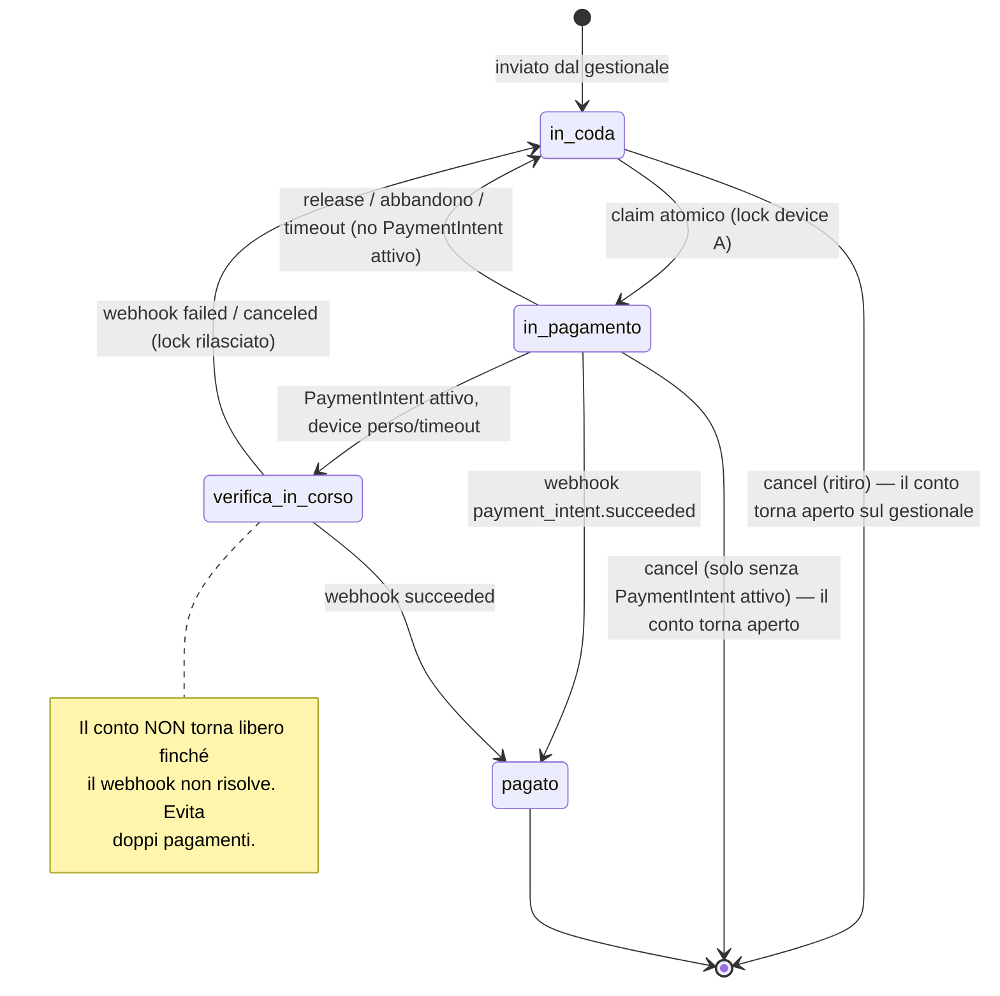
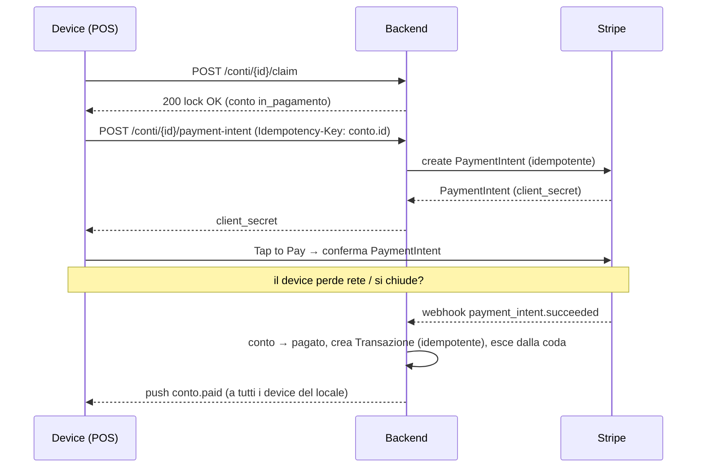

# Specifica Backend — Byup Staff

Spec tecnica del backend a supporto dell'App Staff (**Byup Staff**), derivata dalle decisioni
in [Contesto.md](Contesto.md) (§4 dominio, §5 scelte backend). "POS" = ruolo di terminale di
incasso del dispositivo, non nome di prodotto.

> Stato: **bozza** per implementazione. Le scelte di prodotto sono congelate (Contesto §5.x);
> qui si definiscono modello dati, stati, flussi, API ed eventi realtime.
>
> Nota di stato (lug 2026): nel repo esiste il backend reale di Byup Fresh (`backend/`,
> NestJS — Fase 1 Identity chiusa, vedi `backend/BACKEND.md`); la parte qui specificata
> (coda, lock, pagamenti Stripe) ricade nella Fase 2 «operational core» e **non è ancora
> implementata**.

---

## 1. Scope

**In scope:** coda di incasso condivisa, lock/concorrenza multi-dispositivo, pagamento Tap to
Pay via Stripe (idempotente, webhook-driven), rimborsi, ricevuta di cortesia, aggregazione
giornaliera, autenticazione multi-account + credenziale Face ID di dispositivo.

**Non-goal (per ora):** composizione del conto sul POS (Fase 2, Contesto §4 "Fase 2");
corrispettivi fiscali (li emette il gestionale); reportistica storica estesa (sul gestionale).

**Confini di sistema:**
- **Gestionale (Byup Fresh):** unica superficie di composizione/modifica del conto; emette i
  corrispettivi fiscali; abilita/revoca gli account; possiede lo storico esteso.
- **Backend Byup Staff:** coda, lock, orchestrazione pagamenti, ricevute, sessioni.
- **Stripe:** PaymentIntent, capture, refund, payout. **Fonte di verità del "pagato"** via webhook.

---

## 2. Modello dati

### 2.1 Conto (entità della coda)

| Campo | Tipo | Note |
|------|------|------|
| `id` | string | Identità univoca. Un re-invio dopo correzione è un **conto nuovo** (id nuovo). |
| `merchantId` | string | Locale proprietario della coda. |
| `tavolo` | int | |
| `coperti` | int | |
| `importo` | int (cent) | **Immutabile** lato POS. Sempre in centesimi, valuta da `merchant`. |
| `righe`, `split`, `sconti` | json | Snapshot inviato dal gestionale; il POS non li modifica. |
| `stato` | enum | Vedi §3 (`in_coda` … `pagato`). |
| `originaContoId` | string? | Riferimento al **predecessore** se il conto sostituisce un conto corretto. |
| `inviatoAt` | timestamp | Ora di ingresso in coda. |
| `lock` | Lock? | Presente se preso in carico (§2.3). |

### 2.2 Pagamento (transazione)

| Campo | Tipo | Note |
|------|------|------|
| `id` | string | Id transazione (es. `t_…`). |
| `contoId` | string | Conto pagato. |
| `merchantId` | string | |
| `accountId` | string | **Account che ha incassato** (attribuzione, §8). |
| `deviceId` | string | Dispositivo che ha incassato. |
| `stripePaymentIntentId` | string | Mappatura 1:1 con il conto (§5). |
| `importo` | int (cent) | |
| `brand`, `last4` | string | Da Stripe (es. `Visa`, `4242`; `——` per wallet). |
| `stato` | enum | `processing` \| `ok` \| `fail` \| `refund` (parz./tot.). |
| `creatoAt`, `confermatoAt` | timestamp | `confermatoAt` impostato dal webhook. |
| `giornataId` | string | Giornata operativa di appartenenza (§7). |

### 2.3 Lock

| Campo | Tipo | Note |
|------|------|------|
| `contoId` | string | Uno per conto (esclusività). |
| `deviceId`, `accountId` | string | Chi detiene il lock. |
| `acquiredAt` | timestamp | |
| `expiresAt` | timestamp | TTL; rinnovato dall'heartbeat (§4). |

### 2.4 Account / Device

- **Account**: credenziali (email/password o Google SSO), abilitazione al `merchantId`
  gestita dal gestionale.
- **DeviceCredential**: token long-lived legato a (account, device), sbloccabile da Face ID,
  **revocabile** server-side (§8.2). Nessun dato biometrico sul server.

---

## 3. Macchina a stati del conto (server-side)

**Regole chiave:**
- `in_pagamento` è esclusivo: visibile agli altri dispositivi come *bloccato*, non
  selezionabile né annullabile da loro.
- Il passaggio a `pagato` è guidato **solo dal webhook**, mai dal dispositivo.
- Il **ritiro non è uno stato del conto**: il conto ritirato esce dalla coda e **torna aperto** (di nuovo modificabile sul gestionale); del ritiro restano **momento e autore** (`queue_withdrawn_at`) (Contesto §4).

---

## 4. Concorrenza: claim atomico, lock, heartbeat

- **Claim atomico**: `POST /conti/{id}/claim` esegue un compare-and-set
  `stato: in_coda → in_pagamento` con creazione del lock. Riesce **solo** se il conto è in
  `in_coda`. In caso di conflitto → `409 Conflict` (già preso da un altro dispositivo).
- **TTL + heartbeat**: il lock ha `expiresAt` breve (proposta: **60 s**). Il dispositivo che
  detiene il conto invia `POST /conti/{id}/heartbeat` (proposta: ogni **20 s**) che sposta
  `expiresAt` in avanti. Durante un PaymentIntent attivo l'heartbeat **continua**.
- **Rilascio**:
  - esplicito (`release`) all'uscita dalla schermata senza pagare;
  - per **timeout** (job server) → **condizionato**: rilascia a `in_coda` *solo se* non c'è un
    PaymentIntent attivo/riuscito per il conto; altrimenti → `verifica_in_corso` (§5).
- Un conto in `in_pagamento`/`verifica_in_corso` **non è claimabile né annullabile** da altri.

---

## 5. Flusso di pagamento (idempotente, webhook-driven)

- **Idempotenza creazione PaymentIntent**: `Idempotency-Key = conto.id`. Un retry del device
  restituisce **lo stesso** PaymentIntent → niente doppio addebito (Contesto §5.3).
- **Mappatura 1:1**: un conto ↔ un PaymentIntent. Se serve un nuovo tentativo dopo un fallimento
  definitivo, è gestito come nuovo PaymentIntent legato allo stesso conto (vedi §9 errori).
- **Conferma "pagato" solo da webhook** `payment_intent.succeeded`; la creazione della
  Transazione lato backend è **idempotente** sull'event id / PaymentIntent id (i webhook
  possono arrivare più volte).

### 5.1 Eventi Stripe gestiti

| Evento | Effetto backend |
|--------|-----------------|
| `payment_intent.succeeded` | Conto → `pagato`; crea/aggiorna Transazione `ok`; esce dalla coda; push `conto.paid`. |
| `payment_intent.payment_failed` | Transazione `fail`; conto → `in_coda` (lock rilasciato) o resta selezionabile per nuovo tentativo. |
| `payment_intent.canceled` | Conto → `in_coda`; lock rilasciato. |
| `charge.refunded` | Transazione → `refund` (parziale/totale); push `tx.refunded`. |

---

## 6. Rimborsi

- `POST /transazioni/{id}/refund` (full o `{ importo }` parziale) → crea **refund Stripe**.
- Lo stato `refund` della transazione è confermato dal webhook `charge.refunded` (idempotente).
- **Vincolo prodotto** (Contesto §5.5): dal POS il refund è ammesso **solo per le transazioni
  della giornata corrente**. I rimborsi su transazioni passate avvengono sul gestionale.
  Il backend rifiuta refund da device su transazioni fuori `giornataId` corrente → `403`.

---

## 7. Giornata operativa e aggregati

- **Confine giornata configurabile per locale** (Contesto §5.4): `merchant.chiusuraOraria`
  (es. `04:00`). La `giornataId` di una transazione è calcolata server-side sul fuso del
  locale; fallback a mezzanotte se non impostato.
- `GET /transazioni?giornata=corrente` ritorna **solo** le transazioni della giornata corrente
  del locale (il POS è a giornata singola).
- **"Incassato oggi"**: aggregato server-side **per locale** (`somma importi stato=ok` +
  `conteggio`), non ricalcolato dal client. Disponibile via `GET /riepilogo?giornata=corrente`.
- L'aggregato è **per locale** anche con più operatori; l'attribuzione per account è registrata
  ma non esposta nel totale (estensione opzionale, Contesto §5.8).

---

## 8. Autenticazione, sessione, multi-account, Face ID

### 8.1 Login e sessione

- Metodi: **email/password** e **Google SSO**.
- Emissione di **access token** (breve) + **refresh token** (sessione). Un locale può avere
  **più account abilitati** (Contesto §5.8); l'autorizzazione al `merchantId` è verificata a
  ogni richiesta.
- **Logout esplicito** invalida la sessione e (vedi 8.2) la credenziale Face ID del dispositivo.

### 8.2 Face ID = credenziale di dispositivo

- "Attivare il Face ID" = emettere una **DeviceCredential** long-lived legata a (account,
  device), conservata nel keychain e **sbloccabile localmente dal Face ID**. Il backend **non
  vede e non conserva** alcun dato biometrico (Contesto §5.6).
- Endpoint: `POST /auth/device-credential` (enroll, dopo login valido) /
  `DELETE /auth/device-credential` (revoca).
- Revoca server-side: al **cambio password**, da "dispositivi collegati", o al logout esplicito.
- Il re-login con Face ID scambia la DeviceCredential per un nuovo access token, senza password.
- **Nota UI/prototipo**: il "primo tentativo fallisce sempre" del prototipo è solo simulazione
  visiva; il backend non ha alcun ruolo nel risultato del riconoscimento biometrico (è locale
  al dispositivo: Secure Enclave su iOS, Keystore/TEE su Android).

---

## 9. API (bozza REST)

| Metodo | Endpoint | Scopo |
|--------|----------|-------|
| GET | `/queue` | Coda di incasso del locale (conti `in_coda`/`in_pagamento`). |
| POST | `/conti/{id}/claim` | Presa in carico atomica (lock). `409` se già preso. |
| POST | `/conti/{id}/heartbeat` | Rinnova il lock. |
| POST | `/conti/{id}/release` | Rilascio volontario del lock. |
| POST | `/conti/{id}/cancel` | Annulla → rimanda al gestionale (solo senza PaymentIntent attivo). |
| POST | `/conti/{id}/payment-intent` | Crea/recupera PaymentIntent (Idempotency-Key = conto.id). |
| POST | `/transazioni/{id}/refund` | Rimborso (solo giornata corrente da device). |
| POST | `/transazioni/{id}/receipt` | Invia ricevuta di cortesia (`{ canale: sms\|email, contatto }`). |
| GET | `/transazioni?giornata=corrente` | Transazioni della giornata corrente del locale. |
| GET | `/riepilogo?giornata=corrente` | Aggregato incassato/conteggio per locale. |
| POST | `/auth/login`, `/auth/google`, `/auth/refresh`, `/auth/logout` | Sessione. |
| POST/DELETE | `/auth/device-credential` | Enroll/revoca credenziale Face ID. |
| POST | `/stripe/webhook` | Ricezione eventi Stripe (firma verificata). |

**Ricevuta (§ prodotto):** è **di cortesia, non fiscale** (Contesto §5.7). `receipt` invia via
gateway SMS / email transazionale; nessun obbligo di conservazione fiscale lato POS.
Il `contatto` serve alla sola consegna e non si conserva (D-23 · P-21): il server lo passa al
gateway e lo scarta, sulla transazione resta il solo `canale`, il POS non lo ripropone e non lo
tiene in memoria locale, e un reinvio richiede di chiederlo di nuovo al cliente.

---

## 10. Realtime (propagazione alla coda)

Canale push/websocket per `merchantId`. Eventi minimi:

| Evento | Quando |
|--------|--------|
| `conto.added` | Nuovo conto inviato dal gestionale alla coda. |
| `conto.locked` | Conto preso in carico (mostra "in pagamento su un altro dispositivo"). |
| `conto.unlocked` | Lock rilasciato (release/timeout/fail). |
| `conto.paid` | Conto pagato → esce dalla coda per tutti. |
| `conto.canceled` | Conto annullato → esce dalla coda. |
| `tx.refunded` | Transazione rimborsata. |

I client riconciliano lo stato locale su questi eventi; lo stato autoritativo resta il backend.

---

## 11. Edge cases

- **Doppio claim simultaneo** → il compare-and-set garantisce un solo vincitore; l'altro riceve
  `409` e mostra il conto come bloccato.
- **Device offline durante il pagamento** → conto in `verifica_in_corso`; risolto dal webhook.
  Nessun rilascio "a tavolino".
- **Webhook duplicati / fuori ordine** → tutte le scritture sono **idempotenti** su event id /
  PaymentIntent id.
- **Pagamento fallito** → la Transazione resta come `fail` nello storico di giornata; il conto
  torna selezionabile per un nuovo tentativo.
- **Lock scaduto per crash del device senza PaymentIntent** → rilascio normale a `in_coda`.
- **Annulla durante PaymentIntent attivo** → vietato (`409`/`403`): prima si risolve il pagamento.

---

## 12. Da definire in fase implementativa

Parametri da tarare (non scelte di prodotto):

- Valori di **TTL lock** e **intervallo heartbeat** (proposta 60 s / 20 s).
- **Timeout PaymentIntent** e politica di nuovo tentativo dopo `fail`.
- Tecnologia realtime (WebSocket vs SSE vs push provider) e autenticazione del canale.
- Formato e contenuto della **ricevuta di cortesia** (template SMS/email).
